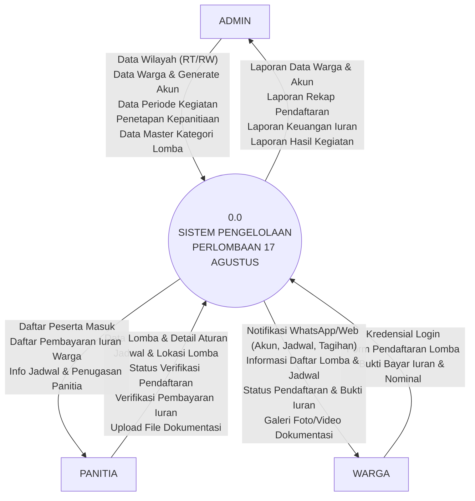
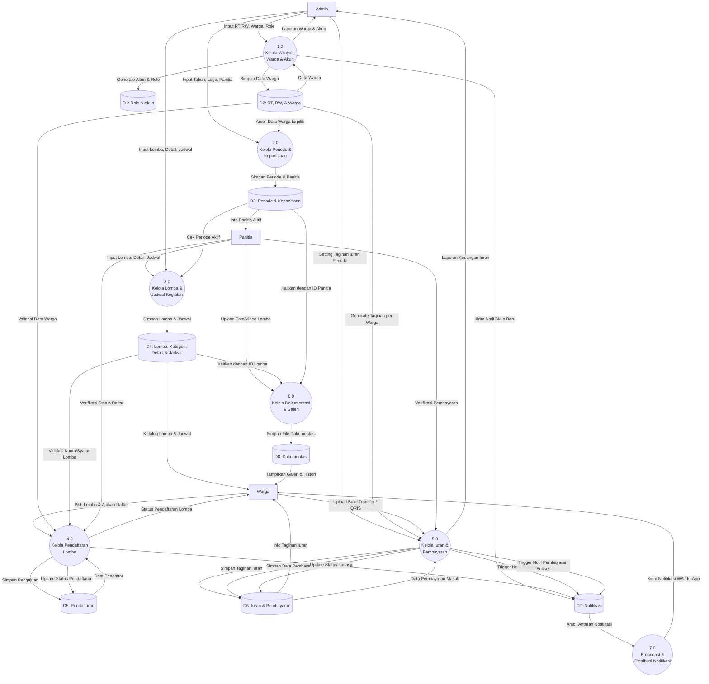

# DATA FLOW DIAGRAM (DFD)
## SISTEM PENGELOLAAN PERLOMBAAN 17 AGUSTUS

Dokumen ini berisi kode Diagram Konteks (Level 0) dan DFD Level 1 yang siap di-copy ke **[mermaid.live](https://mermaid.live)** atau **[draw.io](https://app.diagrams.net)**.

---

## 1. KODE DIAGRAM KONTEKS (DFD LEVEL 0)

Copy semua kode di dalam kotak di bawah ini:

---

## 2. KODE DFD LEVEL 1 (DEKOMPOSISI 7 PROSES)

Copy semua kode di dalam kotak di bawah ini:

---

## 3. CARA MENGGUNAKAN KODE DI ATAS:

### Pilihan 1: Di Website [Mermaid Live Editor](https://mermaid.live)
1. Buka [https://mermaid.live](https://mermaid.live)
2. Hapus teks contoh di sebelah kiri.
3. Copy salah satu kode blok di atas (mulai dari kata `flowchart TD` sampai baris terakhir).
4. Paste ke kolom sebelah kiri. Diagram langsung tergambar otomatis di kanan!
5. Klik tombol **Download PNG** untuk menyimpan gambar.

### Pilihan 2: Di Website [Draw.io](https://app.diagrams.net)
1. Buka [https://app.diagrams.net](https://app.diagrams.net)
2. Klik menu **Arrange** -> **Insert** -> **Advanced** -> **Mermaid**.
3. Paste kodenya di sana lalu klik **Insert**.

